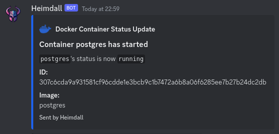
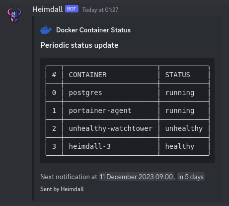
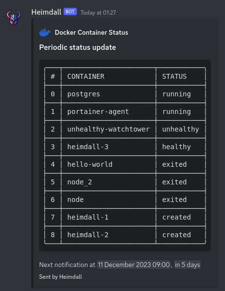

<div align="center">
    <a href="https://hermes.fractum.nl">
        
    </a>
    <h1>Heimdall</h1>
    <p><i>Docker container state monitor with notifications for Discord</i></p>
    <h4>Get Heimdall</h4>

[](https://hub.docker.com/r/drfractum/heimdall)
[](https://github.com/RobinHeidenis/heimdall/releases)

<h4>Status badges</h4>
<div>


</div>
</div>

<!-- TOC -->
<details>
    <summary>Table of Contents</summary>
    <ol>
        <li>
          <a href="#about-heimdall">About Heimdall</a>
        </li>
        <li>
          <a href="#features">Features</a>
        </li>
        <li>
            <a href="#usage">Usage</a>
            <ul>
                <li><a href="#docker-container">Docker container</a></li>
                <ul>
                    <li><a href="#using-docker-desktop">Using Docker Desktop</a></li>
                </ul>
                <li><a href="#standalone-application">Standalone application</a></li>
                <ul>
                    <li><a href="#using-docker-desktop-1">Using Docker Desktop</a></li> 
                </ul>
            </ul>
        </li>
        <li>
          <a href="#technologies">Technologies</a>
          <ul>
            <li><a href="#language">Language</a></li>
            <li><a href="#deployed-to">Deployed to</a></li>
            <li><a href="#cicd">CI/CD</a></li>
            <li><a href="#released-using">Released using</a></li>
            <li><a href="#logo-created-using">Logo created using</a></li>
          </ul>
        </li>
        <li>
          <a href="#screenshots">Screenshots</a>
            <ul>
                <li><a href="#terminal-output">Terminal output</a></li>
                <li><a href="#discord-notifications">Discord notifications</a></li>
                <ul>
                    <li><a href="#container-started">Container started</a></li>
                    <li><a href="#container-stopped">Container stopped</a></li>
                    <li><a href="#container-healthy">Container healthy</a></li>
                    <li><a href="#container-unhealthy">Container unhealthy</a></li>
                    <li><a href="#container-errored">Container errored</a></li>
                </ul>
                <li><a href="#periodic-notification">Periodic notification</a></li>
                <ul>
                    <li><a href="#running-containers">Running containers</a></li>
                    <li><a href="#all-containers">All containers</a></li>
                </ul>
            </ul>
        </li>
      </ol>
</details>
<!-- TOC -->

## About Heimdall
Heimdall is a monitoring application for your Docker containers. It sends you notifications through a webhook whenever the state of a container changes.
It does this by using the Docker socket to listen for events. Heimdall also provides the option to receive periodic notifications about the state of your containers, where it sends you an overview of every container's status.

## Features
- [x] Easy monitoring for Docker containers
- [x] Receive notifications through Discord webhooks
- [x] Receive periodic notifications about the state of your containers
- [ ] Status API
- [ ] Web UI
- [ ] Bugs (hopefully)

## Usage
Heimdall can be used in a couple different ways:
1. As a Docker container
2. As a standalone application

### Docker container
The easiest way to use Heimdall is by running it as a Docker container. You can do this by running the following command:
```bash
docker run -d \
    -v /var/run/docker.sock:/var/run/docker.sock \
    -e HEIMDALL_WEBHOOK_URL=<your-webhook-url> \
    --name heimdall \
    drfractum/heimdall:latest
```

#### Using Docker Desktop
In some cases, Docker Desktop puts the Docker socket in a different location than the standard Docker installation.
You can change the above command to the following to point to the right location:
```diff
docker run -d \
-    -v /var/run/docker.sock:/var/run/docker.sock \
+    -v ~/.docker/desktop/docker.sock:/var/run/docker.sock \
    -e HEIMDALL_WEBHOOK_URL=<your-webhook-url> \
    --name heimdall \
    drfractum/heimdall:latest
```

### Standalone application
You can also run Heimdall as a standalone application. This is useful if you want to run it on a server or your local machine.
To run Heimdall as a standalone application, you can download the latest release from the [releases page](https://github.com/RobinHeidenis/heimdall/releases).

Be sure to download the right binary for your operating system.

| Platform                                                                                                 | Binary                  |
|----------------------------------------------------------------------------------------------------------|-------------------------|
|        | heimdall_Linux_x86_64   |
|   | heimdall_Linux_armv7    |
|  | heimdall_Windows_x86_64 |
|    | heimdall_Darwin_x86_64  |

Other binaries are available in case you have a different architecture or operating system.
Other binaries are available in case you have a different architecture or operating system.


After downloading the release, you can run it by executing the following command:
```bash
./heimdall --webhook-url=<your-webhook-url>
```

On Windows you can run it by executing the following command:
```bash
heimdall.exe --webhook-url=<your-webhook-url>
```

#### Using Docker Desktop
In some cases if you're using Docker Desktop, you might run into an error where Heimdall can't connect to the Docker socket.
By default, Docker Desktop puts the Docker socket in a different location than the standard Docker installation.
If Heimdall doesn't automatically detect your environment and the right location for the Docker socket, you'll need to create a symlink to the docker.sock file. You can do this by running the following command:
```bash
sudo ln -s ~/.docker/desktop/docker.sock /var/run/docker.sock
```

## Customisation
Heimdall can be customised by using flags or environment variables. Either works, but flags take precedence over environment variables. Short flags can be used in place of the longer flags to save some typing.

| Long flag                 | Short flag | Environment Variable             | Default   | Required                                                                                         | Explanation                                                                                      |
|---------------------------|------------|----------------------------------|-----------|--------------------------------------------------------------------------------------------------|--------------------------------------------------------------------------------------------------|
| `--periodic-notification` | `-n`       | `HEIMDALL_PERIODIC_NOTIFICATION` | `false`   | No                                                                                               | Enable periodic notifications                                                                    |
| `--notification-interval` | `-i`       | `HEIMDALL_NOTIFICATION_INTERVAL` | `60`      | Only if periodic notifications are enabled and you want a different value than default           | How often (in minutes) periodic notifications should be sent                                     |
| `--all-containers`        | `-a`       | `HEIMDALL_ALL_CONTAINERS`        | `false`   | Only if periodic notifications are enabled and you want periodic notifications on all containers | Enable periodic notification reporting on all containers, including stopped ones                 |
| `--retry`                 | `-r`       | `HEIMDALL_RETRY`                 | `10`      | No                                                                                               | How long Heimdall should sleep before retrying in case the Docker event stream ends unexpectedly |
| `--provider`              | `-p`       | `HEIMDALL_PROVIDER`              | `discord` | No                                                                                               | What notification provider should be used. Possible values: `discord`                            |
| `--webhook-url`           | `-w`       | `HEIMDALL_WEBHOOK_URL`           | -         | Yes                                                                                              | What URL Heimdall should use to send notifications to                                            |
| `--debug`                 | `-d`       | `HEIMDALL_DEBUG`                 | `false`   | No                                                                                               | Enable extra debug messages                                                                      |


## Technologies
Heimdall was created using Go. The CI/CD pipeline is handled by GitHub Actions and the Docker image is hosted on Docker Hub.

The program is mostly based on the [Docker SDK for Go](https://pkg.go.dev/github.com/docker/docker/client#section-readme)

It uses the following technologies:
### Language
[](https://go.dev)

### Deployed to
[](https://hub.docker.com/r/drfractum/heimdall)

### CI/CD
[](https://github.com/RobinHeidenis/heimdall/actions)

### Released using
[](https://goreleaser.com)

### Logo created using
[](https://www.bing.com/images/create)


## Screenshots
### Terminal output


### Discord notifications
#### Container started


#### Container stopped


#### Container healthy


#### Container unhealthy


#### Container errored


### Periodic notification
#### Running containers


#### All containers

